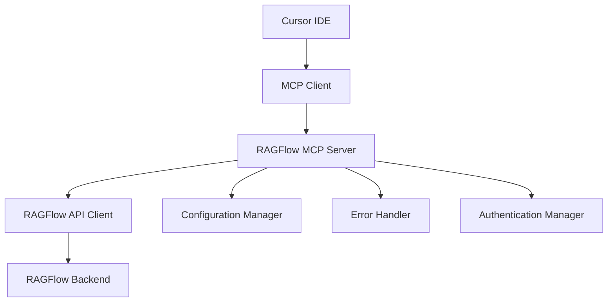

# Design Document

## Overview

RAGFlow MCP Server là một Model Context Protocol server được thiết kế để tích hợp RAGFlow API vào Cursor IDE. Server này cung cấp các công cụ MCP để thực hiện các thao tác quản lý tài liệu và tìm kiếm thông qua RAGFlow, cho phép developers tương tác với knowledge base một cách seamless trong quá trình phát triển.

Server sẽ được implement bằng Python và tuân thủ MCP specification, cung cấp các tools để upload, update, search, list và delete documents trong RAGFlow.

## Architecture

### High-Level Architecture



### Component Breakdown

1. **MCP Server Core**: Xử lý MCP protocol và routing requests
2. **RAGFlow API Client**: Wrapper cho RAGFlow HTTP API
3. **Configuration Manager**: Quản lý cấu hình API endpoint và credentials
4. **Authentication Manager**: Xử lý authentication với RAGFlow
5. **Error Handler**: Centralized error handling và logging
6. **File Manager**: Xử lý file operations và validation

## Components and Interfaces

### 1. MCP Server Interface

```python
class RAGFlowMCPServer:
    """Main MCP server class implementing MCP protocol"""
    
    async def handle_initialize(self, params: InitializeParams) -> InitializeResult
    async def handle_list_tools(self, params: ListToolsParams) -> ListToolsResult
    async def handle_call_tool(self, params: CallToolParams) -> CallToolResult
```

### 2. RAGFlow API Client

```python
class RAGFlowClient:
    """Client for interacting with RAGFlow HTTP API"""
    
    async def upload_file(self, file_path: str, dataset_id: str) -> UploadResult
    async def update_file(self, file_id: str, file_path: str) -> UpdateResult
    async def search(self, query: str, dataset_id: str, **kwargs) -> SearchResult
    async def list_files(self, dataset_id: str) -> ListFilesResult
    async def delete_file(self, file_id: str) -> DeleteResult
    async def get_file_status(self, file_id: str) -> FileStatus
```

### 3. MCP Tools Definition

Server sẽ cung cấp các MCP tools sau:

#### ragflow_upload_file
- **Description**: Upload và embed một file mới vào RAGFlow
- **Parameters**: 
  - `file_path` (string, required): Đường dẫn đến file cần upload
  - `dataset_id` (string, required): ID của dataset trong RAGFlow
  - `chunk_method` (string, optional): Phương pháp chia chunk (default: "naive")

#### ragflow_update_file
- **Description**: Cập nhật và re-embed file đã tồn tại
- **Parameters**:
  - `file_id` (string, required): ID của file cần cập nhật
  - `file_path` (string, required): Đường dẫn đến file mới

#### ragflow_search
- **Description**: Tìm kiếm trong RAGFlow knowledge base
- **Parameters**:
  - `query` (string, required): Câu truy vấn tìm kiếm
  - `dataset_id` (string, required): ID của dataset cần search
  - `limit` (integer, optional): Số lượng kết quả tối đa (default: 10)
  - `similarity_threshold` (float, optional): Ngưỡng similarity (default: 0.1)

#### ragflow_list_files
- **Description**: Liệt kê tất cả files trong dataset
- **Parameters**:
  - `dataset_id` (string, required): ID của dataset

#### ragflow_delete_file
- **Description**: Xóa file khỏi RAGFlow
- **Parameters**:
  - `file_id` (string, required): ID của file cần xóa

#### ragflow_get_datasets
- **Description**: Lấy danh sách các datasets có sẵn
- **Parameters**: Không có

## Data Models

### Configuration Model
```python
@dataclass
class RAGFlowConfig:
    base_url: str
    api_key: str
    default_dataset_id: Optional[str] = None
    timeout: int = 30
    max_retries: int = 3
```

### API Response Models
```python
@dataclass
class UploadResult:
    file_id: str
    status: str
    message: str
    chunk_count: Optional[int] = None

@dataclass
class SearchResult:
    results: List[SearchItem]
    total_count: int
    query_time: float

@dataclass
class SearchItem:
    content: str
    score: float
    file_name: str
    file_id: str
    chunk_id: str
```

## Error Handling

### Error Categories

1. **Configuration Errors**: Thiếu hoặc sai cấu hình API
2. **Authentication Errors**: Token không hợp lệ hoặc hết hạn
3. **Network Errors**: Lỗi kết nối đến RAGFlow API
4. **File Errors**: File không tồn tại, format không hỗ trợ
5. **API Errors**: Lỗi từ RAGFlow API response

### Error Handling Strategy

```python
class RAGFlowError(Exception):
    """Base exception for RAGFlow operations"""
    pass

class ConfigurationError(RAGFlowError):
    """Configuration related errors"""
    pass

class AuthenticationError(RAGFlowError):
    """Authentication related errors"""
    pass

class APIError(RAGFlowError):
    """RAGFlow API related errors"""
    pass
```

### Retry Logic
- Network errors: Exponential backoff với max 3 retries
- Rate limiting: Respect RAGFlow API rate limits
- Authentication errors: Không retry, yêu cầu user action

## Testing Strategy

### Unit Tests
- Test từng component riêng biệt
- Mock RAGFlow API responses
- Test error handling scenarios
- Test configuration validation

### Integration Tests
- Test với RAGFlow API thật (test environment)
- Test MCP protocol compliance
- Test file upload/download workflows
- Test search functionality end-to-end

### Test Structure
```
tests/
├── unit/
│   ├── test_ragflow_client.py
│   ├── test_mcp_server.py
│   ├── test_config.py
│   └── test_error_handling.py
├── integration/
│   ├── test_ragflow_integration.py
│   └── test_mcp_integration.py
└── fixtures/
    ├── sample_files/
    └── mock_responses/
```

## Configuration

### Environment Variables
```bash
RAGFLOW_BASE_URL=http://localhost:9380
RAGFLOW_API_KEY=your_api_key_here
RAGFLOW_DEFAULT_DATASET_ID=optional_default_dataset
RAGFLOW_TIMEOUT=30
RAGFLOW_MAX_RETRIES=3
```

### MCP Configuration
Server sẽ được cấu hình trong Cursor's MCP settings:
```json
{
  "mcpServers": {
    "ragflow": {
      "command": "python",
      "args": ["-m", "ragflow_mcp_server"],
      "env": {
        "RAGFLOW_BASE_URL": "http://localhost:9380",
        "RAGFLOW_API_KEY": "your_api_key"
      }
    }
  }
}
```

## Security Considerations

1. **API Key Management**: API keys được lưu trong environment variables, không hardcode
2. **Input Validation**: Validate tất cả user inputs trước khi gửi đến API
3. **File Path Validation**: Kiểm tra file paths để tránh directory traversal
4. **Error Message Sanitization**: Không expose sensitive information trong error messages
5. **Rate Limiting**: Respect RAGFlow API rate limits để tránh bị block

## Performance Considerations

1. **Async Operations**: Sử dụng async/await cho tất cả API calls
2. **Connection Pooling**: Reuse HTTP connections cho multiple requests
3. **Caching**: Cache dataset information để giảm API calls
4. **File Size Limits**: Validate file size trước khi upload
5. **Timeout Handling**: Set reasonable timeouts cho các operations

## Deployment

### Package Structure
```
ragflow_mcp_server/
├── __init__.py
├── __main__.py
├── server.py
├── client.py
├── config.py
├── errors.py
├── models.py
└── utils.py
```

### Installation
Server sẽ được package thành Python package và có thể install via pip:
```bash
pip install ragflow-mcp-server
```

### Usage
```bash
# Run as module
python -m ragflow_mcp_server

# Or direct execution
ragflow-mcp-server
```